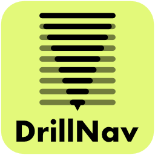

<p align="center">
  
</p>

# DrillNav – Smart Contextual Navigation for Deeply Nested Sites

[](https://github.com/simurech/drillnav/releases)
[](https://wordpress.org/)
[](https://php.net/)
[](https://www.gnu.org/licenses/gpl-2.0.html)

> Contextual drill-down navigation that adapts to the current page — perfect for deeply nested WordPress sites. Zero configuration required.

**→ Plugin on WordPress.org (Coming soon)** — full description, screenshots, FAQ, and installation guide.

---

## What it does

Standard WordPress navigation shows every page at once — overwhelming on sites with hundreds of nested pages. DrillNav shows only what's relevant **right now**:

- **Ancestor path** — breadcrumb-style back navigation
- **Current level** — siblings of the active page
- **Drill-down** — click to explore child pages via REST API lazy-loading

No manual configuration. Place the block, add the shortcode, or drop in the widget — DrillNav detects the hierarchy automatically.

---

## Features

| Feature | Free | Pro |
|---|:---:|:---:|
| Contextual drill-down navigation | ✓ | ✓ |
| Gutenberg block with live preview | ✓ | ✓ |
| Shortcode `[drillnav]` + sidebar widget | ✓ | ✓ |
| List layout | ✓ | ✓ |
| Horizontal layout | ✓ | ✓ |
| Block variations (5 ready-made presets) | ✓ | ✓ |
| Style presets: Default, Compact, Comfortable | ✓ | ✓ |
| Colour schemes: Default, Light, Dark | ✓ | ✓ |
| Mobile hamburger toggle (side drawer) | ✓ | ✓ |
| RTL support | ✓ | ✓ |
| WPML & Polylang compatibility | ✓ | ✓ |
| Hover-preloading (instant drill-down) | ✓ | ✓ |
| Live settings preview | ✓ | ✓ |
| WCAG 2.1 AA accessible | ✓ | ✓ |
| Accordion layout (full tree, expand/collapse) | — | ✓ |
| Mega navigation (CSS Grid) | — | ✓ |
| Cards style preset | — | ✓ |
| Granular CSS overrides (9 custom properties) | — | ✓ |
| WooCommerce product category navigation | — | ✓ |
| Attribute-based product filtering | — | ✓ |
| Priority support | — | ✓ |

---

## Requirements

| Component | Minimum | Recommended |
|---|---|---|
| WordPress | 6.3 | Latest |
| PHP | 8.1 | Latest |
| WooCommerce (Pro only) | 8.0 | Latest |

---

## Installation

**Via WordPress.org (recommended):**
1. In the WordPress dashboard, go to **Plugins → Add New**.
2. Search for **DrillNav** and install it.

**Manual install from GitHub:**
1. Download the latest release `.zip` from the [Releases page](https://github.com/simurech/drillnav/releases).
2. In WordPress, go to **Plugins → Add New → Upload Plugin**.

**After activation:**
1. Insert the **DrillNav block** in the editor, add `[drillnav]` to any page, or place the widget in a sidebar.
2. Visit any page in your hierarchy — the navigation adapts automatically.
3. Configure global defaults in **Settings → DrillNav**.

---

## Usage

### Block (recommended)

Search for **DrillNav** in the block inserter. Use the Inspector panel to configure each instance independently. Five block variations are included:

| Variation | Layout | Description |
|---|---|---|
| DrillNav (default) | List | Standard contextual navigation |
| Horizontal Navigation | Horizontal | Items in a horizontal row |
| Compact List | List | Reduced padding for tight sidebars |
| Dark Navigation | List | Dark colour scheme |
| Accordion (Pro) | Accordion | Full page tree, expandable |
| Mega Navigation (Pro) | Mega | CSS Grid multi-column layout |

### Shortcode

```
[drillnav]
```

All attributes are optional and override the global settings for that instance:

| Attribute | Default | Description |
|---|---|---|
| `depth` | `0` | Max hierarchy depth (0 = unlimited) |
| `show_home` | `yes` | Show home link as first back-navigation step |
| `home_label` | site name | Custom label for the home link |
| `post_type` | `page` | Hierarchical post type to navigate |
| `layout` | `list` | `list`, `horizontal`, `accordion` (Pro), `mega` (Pro) |
| `style_preset` | `default` | `default`, `compact`, `comfortable`, `cards` (Pro) |
| `mobile_toggle` | `no` | Hamburger icon + side drawer on mobile (`yes` / `no`) |
| `max_width` | — | Limit container width, e.g. `300px` or `60%` |
| `multiple_back_buttons` | `no` | One back button per drilled level (`yes` / `no`) |

Example:
```
[drillnav depth="3" layout="horizontal" style_preset="compact" mobile_toggle="yes"]
```

### Widget

Go to **Appearance → Widgets** and add **DrillNav – Contextual Navigation** to any sidebar.

---

## Layouts

### List (Free)
The default layout. Items stacked vertically, drill-down replaces the visible list.

### Horizontal (Free)
Items arranged in a row. Works great in headers and sticky bars.

### Accordion (Pro)
The full page tree is server-side rendered with JS-powered expand/collapse. No REST requests — works without JavaScript for initial load.

### Mega Navigation (Pro)
CSS Grid multi-column layout. Top-level categories as column headers with children below.

---

## Developer Hooks

```php
// Filter the complete navigation data before rendering
add_filter( 'drillnav_nav_items', function( $data, $args ) {
    return $data;
}, 10, 2 );

// Filter the resolved page context
add_filter( 'drillnav_current_context', function( $context ) {
    return $context;
} );

// Filter the children item list for a given parent
add_filter( 'drillnav_children_items', function( $items, $parent_id, $args ) {
    return $items;
}, 10, 3 );

// Add CSS classes to a navigation item's <li>
add_filter( 'drillnav_item_classes', function( $classes, $item, $layout ) {
    if ( $item['is_current'] ) {
        $classes[] = 'my-active-item';
    }
    return $classes;
}, 10, 3 );

// Add HTML attributes to a navigation item's <a>
add_filter( 'drillnav_item_attrs', function( $attrs, $item, $layout ) {
    $attrs['data-post-id'] = $item['id'];
    return $attrs;
}, 10, 3 );

// Adjust cache TTL (default: 7 days)
add_filter( 'drillnav_cache_duration', function( $seconds ) {
    return WEEK_IN_SECONDS * 2;
} );
```

**REST API:** `GET /wp-json/drillnav/v1/children?post_id=123&post_type=page`

---

## CSS Custom Properties

Override any token in your theme's stylesheet:

```css
.drillnav {
    --drillnav-font-size:         1rem;
    --drillnav-color-bg:          transparent;
    --drillnav-color-text:        inherit;
    --drillnav-color-link:        inherit;
    --drillnav-color-current-bg:  rgba(0, 0, 0, 0.06);
    --drillnav-color-btn-hover:   rgba(0, 0, 0, 0.08);
    --drillnav-color-border:      rgba(0, 0, 0, 0.1);
    --drillnav-color-arrow:       rgba(0, 0, 0, 0.4);
    --drillnav-item-padding-y:    0.5rem;
    --drillnav-item-padding-x:    0.75rem;
    --drillnav-border-radius:     4px;
    --drillnav-transition-speed:  200ms;
    --drillnav-max-width:         none;
}
```

Pro users can set all nine properties globally in **Settings → DrillNav → Customize** or per block instance in the Inspector panel.

---

## Multilingual

DrillNav works out of the box with **WPML** and **Polylang** (since v1.1.0):

- Navigation tree always reflects the active language
- Cache keys are language-aware (each language cached independently)
- Custom labels (Home, Nav, Blog) register with the multilingual plugin's string translation interface
- Three filter hooks for custom integrations: `drillnav_language`, `drillnav_translate_post_id`, `drillnav_translate_string`

---

## RTL Support

Full right-to-left layout support (since v1.4.0):

- CSS logical properties (`padding-inline-start`, `inset-inline-start`) throughout
- Slide animations are mirrored under `[dir="rtl"]`
- Mobile side drawer opens from the right in RTL
- Accordion indent uses `padding-inline-start`

No JavaScript changes required — RTL is handled entirely in CSS.

---

## Roadmap

| Feature | Tier |
|---|---|
| Settings Page Tabs (7 granular tabs: General, Appearance & Styling, Behavior, Blog, WooCommerce, Advanced, Tracking) | Free |
| Automatic Dark-Mode (prefers-color-scheme) | Free |
| Native Page Builder Widgets (Elementor, Divi, Beaver Builder) | Free/Pro |
| Hybrid Menus: Combine manual WP Menus with auto-populated WooCommerce categories (High Priority) | Pro |
| WooCommerce attribute-based filtering improvements | Pro |
| Custom Menu Source (Appearance > Menus) | Pro |
| Custom Taxonomy Support | Pro |
| AJAX Content Loading (SPA-like navigation) | Pro |
| Analytics & Event Tracking (DataLayer push, GTM support, custom event names, individual toggles) | Pro |
| Icon Support (Dashicons, SVG, Emojis) | Pro |
| "Highlight" / "Featured" Badges | Pro |
| Off-Canvas Drawer enhancements (Backdrop blur, custom logo, top-slide) | Pro |

---

## License

**DrillNav** is licensed under the [GNU General Public License v2.0 or later](https://www.gnu.org/licenses/gpl-2.0.html).

**Author:** Simon Urech — [@simurech](https://github.com/simurech)
